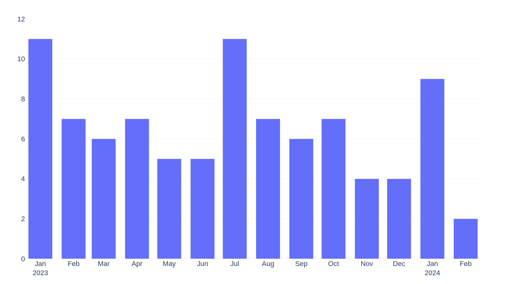

# My Collections

## Movies

- Movies I've seen: 84
- Movies in my collection: 46 (54.8%)
- Last movie I saw: Spider-Man: Across the Spider-Verse - Joaquim Dos Santos, Kemp Powers, Justin K. Thompson
- I've seen movies from 15 countries

### Ranked

#### Favorite (2 movies)

| Director        | Title    |   Year | Country   |
|:----------------|:---------|-------:|:----------|
| Damien Chazelle | Whiplash |   2014 | USA       |
| Park Chan-wook  | Oldboy   |   2003 | KOR       |

#### Great (6 movies)

| Director             | Title                                 |   Year | Country   |
|:---------------------|:--------------------------------------|-------:|:----------|
| Boon Joon Ho         | Parasite                              |   2019 | KOR       |
| Damien Chazelle      | La la land                            |   2016 | USA       |
| Damián David Szifron | Relatos Salvajes                      |   2014 | ARG       |
| Denis Villeneuve     | Arrival                               |   2016 | USA       |
| Francis Ford Coppola | The Godfather                         |   1972 | USA       |
| Michel Gondry        | Eternal Sunshine of the Spotless Mind |   2004 | USA       |

#### Good (38 movies)

| Director                                            | Title                                   |   Year | Country   |
|:----------------------------------------------------|:----------------------------------------|-------:|:----------|
| Alejandro Amenábar                                  | Tesis                                   |   1996 | ESP       |
| Alejandro Amenábar                                  | The Others                              |   2001 | ESP       |
| Bennett Miller                                      | Moneyball                               |   2011 | USA       |
| Bob Persichetti, Peter Ramsey, Rodney Rothman       | Spider-Man: Into the Spider-Verse       |   2018 | USA       |
| Danny Philippou, Michael Philippou                  | Talk to Me                              |   2022 | AUS       |
| David Fincher                                       | Fight Club                              |   1999 | USA       |
| David Fincher                                       | Se7en                                   |   1995 | USA       |
| Edward Berger                                       | All Quiet on the Western Front          |   2022 | DEU       |
| Ethan Coen, Joel Coen                               | No Country for Old Men                  |   2007 | USA       |
| Florian Zeller                                      | The Father                              |   2020 | GBR       |
| George Miller                                       | Mad Max: Fury Road                      |   2015 | AUS       |
| J.A. Bayona                                         | La sociedad de la nieve                 |   2023 | ESP       |
| James Ward Byrkit                                   | Coherence                               |   2013 | USA       |
| Joaquim Dos Santos, Kemp Powers, Justin K. Thompson | Spider-Man: Across the Spider-Verse     |   2023 | USA       |
| Joel Crawford, Januel Mercado                       | Puss in Boots: The Last Wish            |   2022 | USA       |
| Jordan Peele                                        | Nope                                    |   2022 | USA       |
| Julia Ducournau                                     | Titane                                  |   2021 | FRA       |
| Junta Yamaguchi                                     | Beyond the Infinite Two Minutes         |   2020 | JPN       |
| Lars von Trier                                      | The House That Jack Built               |   2018 | DNK       |
| Martin Scorsese                                     | The Wolf of Wall Street                 |   2013 | USA       |
| Matt Johnson                                        | BlackBerry                              |   2023 | CAN       |
| Park Chan-wook                                      | Decision to Leave                       |   2022 | KOR       |
| Patrick Brice                                       | Creep                                   |   2014 | USA       |
| Paul Thomas Anderson                                | There will be blood                     |   2007 | USA       |
| Peter Sohn                                          | Elemental                               |   2023 | USA       |
| Quentin Tarantino                                   | Reservoir Dogs                          |   1992 | USA       |
| Quentin Tarantino                                   | Pulp Fiction                            |   1994 | USA       |
| Quentin Tarantino                                   | The Hateful Eight                       |   2015 | USA       |
| Ridley Scott                                        | Gladiator                               |   2000 | USA       |
| Robert Zemeckis                                     | Back to the Future                      |   1985 | USA       |
| Sam Esmail                                          | Leave the World Behind                  |   2023 | USA       |
| Santiago Mitre                                      | Argentina, 1985                         |   2022 | ARG       |
| Spike Jonze                                         | Her                                     |   2013 | USA       |
| Takehiko Inoue                                      | The First Slam Dunk                     |   2022 | JPN       |
| Ti West                                             | X                                       |   2022 | USA       |
| Ti West                                             | Pearl                                   |   2022 | USA       |
| Todd Field                                          | Tár                                     |   2022 | USA       |
| Tom Gormican                                        | The Unbearable Weight of Massive Talent |   2022 | USA       |

Not for me (38 movies)

| Director                           | Title                                             |   Year | Country   |
|:-----------------------------------|:--------------------------------------------------|-------:|:----------|
| Alfonso Cuarón                     | Harry Potter and the Prisoner of Azkaban          |   2004 | GBR       |
| Brad Bird                          | Ratatouille                                       |   2007 | USA       |
| Brandon Cronenberg                 | Possessor                                         |   2020 | CAN       |
| Brandon Cronenberg                 | Infinity Pool                                     |   2023 | CAN       |
| Carlota Pereda                     | Cerdita                                           |   2022 | ESP       |
| Chris Buck, Jennifer Lee           | Frozen                                            |   2013 | USA       |
| Christopher Nolan                  | Oppenheimer                                       |   2023 | USA       |
| Colbert García                     | Silencio en el paraíso                            |   2011 | COL       |
| Darren Aronofsky                   | The Whale                                         |   2022 | USA       |
| David Yates                        | Harry Potter and the Deathly Hallows - Part 1     |   2010 | GBR       |
| David Yates                        | Harry Potter and the Half-Blood Prince            |   2009 | GBR       |
| David Yates                        | Harry Potter and the Order of the Phoenix         |   2007 | GBR       |
| Dean Fleischer-Camp                | Marcel the Shell with Shoes On                    |   2021 | USA       |
| Denis Villeneuve                   | Sicario                                           |   2015 | USA       |
| Edgar Wright                       | Shaun of the Dead                                 |   2004 | GBR       |
| Fabrice Éboué                      | Some Like It Rare                                 |   2021 | FRA       |
| Greta Gerwig                       | Barbie                                            |   2023 | USA       |
| Guillermo del Toro, Mark Gustafson | Guillermo del Toro's Pinocchio                    |   2022 | USA       |
| Hideo Nakata                       | Ringu                                             |   1998 | JPN       |
| Ilya Naishuller                    | Nobody                                            |   2021 | USA       |
| Jalmari Helander                   | Sisu                                              |   2022 | FIN       |
| James Cameron                      | The Terminator                                    |   1984 | USA       |
| James Mangold                      | Indiana Jones and the Dial of Destiny             |   2023 | USA       |
| John Carpenter                     | Halloween                                         |   1978 | USA       |
| John Krasinski                     | A Quiet Place Part II                             |   2020 | USA       |
| John Krasinski                     | A Quiet Place                                     |   2018 | USA       |
| Juan Felipe Orozco                 | Los iniciados                                     |   2023 | COL       |
| Kinji Fukasaku                     | Battle Royale                                     |   2000 | JPN       |
| Lee Cronin                         | Evil Dead Rise                                    |   2023 | USA       |
| Luca Guadagnino                    | Bones and All                                     |   2022 | USA       |
| Mike Newell                        | Harry Potter and the Goblet of Fire               |   2005 | GBR       |
| Oliver Stone                       | Snowden                                           |   2016 | USA       |
| Peter Jackson                      | The Lord of the Rings: The Fellowship of the Ring |   2001 | NZL       |
| Ridley Scott                       | Napoleon                                          |   2023 | USA       |
| Ridley Scott                       | The Martian                                       |   2015 | USA       |
| Ridley Scott                       | Alien                                             |   1979 | USA       |
| Ruben Östlund                      | Triangle of Sadness                               |   2022 | SWE       |
| Wes Anderson                       | Asteroid City                                     |   2023 | USA       |

### Movies by country

<picture>
  <source media="(prefers-color-scheme: dark)" srcset="figures/films_map_plotly_dark.png">
  <source media="(prefers-color-scheme: light)" srcset="figures/films_map_plotly.png">
  
</picture>

### Count of movies I've seen per month

<picture>
  <source media="(prefers-color-scheme: dark)" srcset="figures/movies_by_month_plotly_dark.png">
  <source media="(prefers-color-scheme: light)" srcset="figures/movies_by_month_plotly_white.png">
  
</picture>
