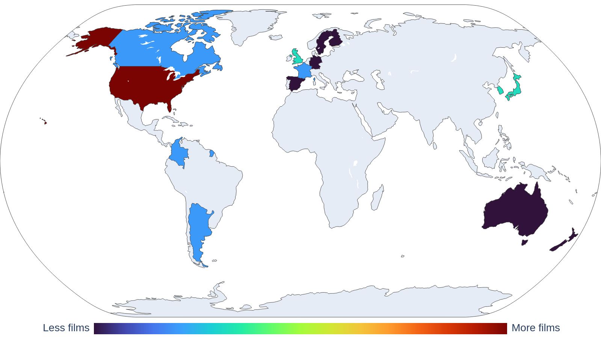

# My Collections

## Movies

- Movies I've seen: 52
- Movies in my collection: 24 (46.2%)
- Last movie I saw: Los iniciados - Juan Felipe Orozco
- I've seen movies from 14 countries

### Ranked

#### Favorite (2 movies)

| director        | title    |   year | country   |
|:----------------|:---------|-------:|:----------|
| Damien Chazelle | Whiplash |   2014 | USA       |
| Park Chan-wook  | Oldboy   |   2003 | KOR       |

#### Great (4 movies)

| director             | title            |   year | country   |
|:---------------------|:-----------------|-------:|:----------|
| Boon Joon Ho         | Parasite         |   2019 | KOR       |
| Damien Chazelle      | La la land       |   2016 | USA       |
| Damián David Szifron | Relatos Salvajes |   2014 | ARG       |
| Denis Villeneuve     | Arrival          |   2016 | USA       |

#### Good (18 movies)

| director                      | title                           |   year | country   |
|:------------------------------|:--------------------------------|-------:|:----------|
| Edward Berger                 | All Quiet on the Western Front  |   2022 | DEU       |
| Ethan Coen, Joel Coen         | No Country for Old Men          |   2007 | USA       |
| Florian Zeller                | The Father                      |   2020 | GBR       |
| George Miller                 | Mad Max: Fury Road              |   2015 | AUS       |
| James Ward Byrkit             | Coherence                       |   2013 | USA       |
| Joel Crawford, Januel Mercado | Puss in Boots: The Last Wish    |   2022 | USA       |
| Jordan Peele                  | Nope                            |   2022 | USA       |
| Julia Ducournau               | Titane                          |   2021 | FRA       |
| Junta Yamaguchi               | Beyond the Infinite Two Minutes |   2020 | JPN       |
| Martin Scorsese               | The Wolf of Wall Street         |   2013 | USA       |
| Park Chan-wook                | Decision to Leave               |   2022 | KOR       |
| Patrick Brice                 | Creep                           |   2014 | USA       |
| Peter Sohn                    | Elemental                       |   2023 | USA       |
| Quentin Tarantino             | Reservoir Dogs                  |   1992 | USA       |
| Ridley Scott                  | Gladiator                       |   2000 | USA       |
| Robert Zemeckis               | Back to the Future              |   1985 | USA       |
| Santiago Mitre                | Argentina, 1985                 |   2022 | ARG       |
| Spike Jonze                   | Her                             |   2013 | USA       |

Not for me (28 movies)

| director                           | title                                             |   year | country   |
|:-----------------------------------|:--------------------------------------------------|-------:|:----------|
| Brad Bird                          | Ratatouille                                       |   2007 | USA       |
| Brandon Cronenberg                 | Infinity Pool                                     |   2023 | CAN       |
| Brandon Cronenberg                 | Possessor                                         |   2020 | CAN       |
| Carlota Pereda                     | Cerdita                                           |   2022 | ESP       |
| Christopher Nolan                  | Oppenheimer                                       |   2023 | USA       |
| Colbert García                     | Silencio en el paraíso                            |   2011 | COL       |
| Darren Aronofsky                   | The Whale                                         |   2022 | USA       |
| Dean Fleischer-Camp                | Marcel the Shell with Shoes On                    |   2021 | USA       |
| Denis Villeneuve                   | Sicario                                           |   2015 | USA       |
| Edgar Wright                       | Shaun of the Dead                                 |   2004 | GBR       |
| Fabrice Éboué                      | Some Like It Rare                                 |   2021 | FRA       |
| Guillermo del Toro, Mark Gustafson | Guillermo del Toro's Pinocchio                    |   2022 | USA       |
| Hideo Nakata                       | Ringu                                             |   1998 | JPN       |
| Jalmari Helander                   | Sisu                                              |   2022 | FIN       |
| James Cameron                      | The Terminator                                    |   1984 | USA       |
| James Mangold                      | Indiana Jones and the Dial of Destiny             |   2023 | USA       |
| John Krasinski                     | A Quiet Place                                     |   2018 | USA       |
| John Krasinski                     | A Quiet Place Part II                             |   2020 | USA       |
| Juan Felipe Orozco                 | Los iniciados                                     |   2023 | COL       |
| Lee Cronin                         | Evil Dead Rise                                    |   2023 | USA       |
| Luca Guadagnino                    | Bones and All                                     |   2022 | USA       |
| Mike Newell                        | Harry Potter and the Goblet of Fire               |   2005 | GBR       |
| Oliver Stone                       | Snowden                                           |   2016 | USA       |
| Peter Jackson                      | The Lord of the Rings: The Fellowship of the Ring |   2001 | NZL       |
| Ridley Scott                       | The Martian                                       |   2015 | USA       |
| Ridley Scott                       | Alien                                             |   1979 | USA       |
| Ruben Östlund                      | Triangle of Sadness                               |   2022 | SWE       |
| Wes Anderson                       | Asteroid City                                     |   2023 | USA       |

### Movies by country

<picture>
  <source media="(prefers-color-scheme: dark)" srcset="figures/films_map_plotly_dark.png">
  <source media="(prefers-color-scheme: light)" srcset="figures/films_map_plotly.png">
  
</picture>
