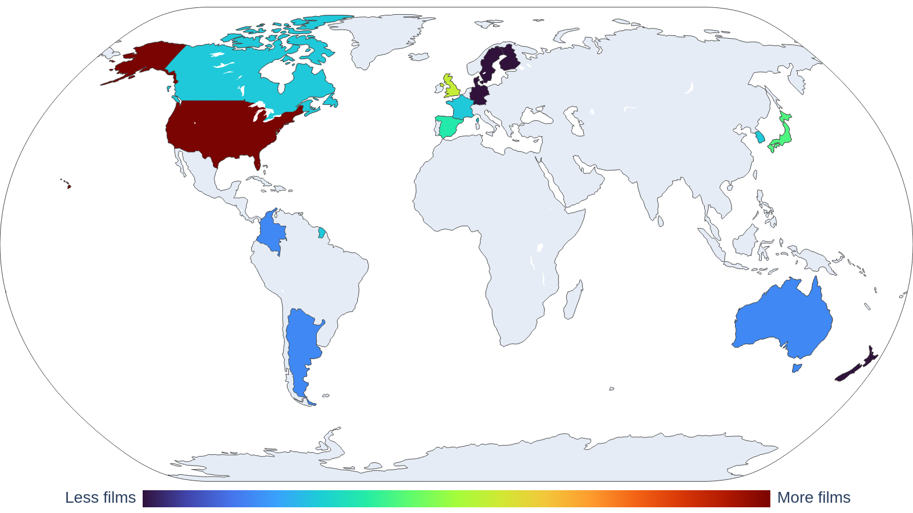

# My Collections

## Movies

- Movies I've seen: 47
- Last movie I saw: Asteroid City

### Ranked

#### Favorite

| director        | title    |   year |   country |
|:----------------|:---------|-------:|----------:|
| Damien Chazelle | Whiplash |   2014 |       nan |
| Park Chan-wook  | Oldboy   |   2003 |       nan |

#### Great

| director             | title            |   year | country   |
|:---------------------|:-----------------|-------:|:----------|
| Boon Joon Ho         | Parasite         |   2019 | KOR       |
| Damien Chazelle      | La la land       |   2016 | nan       |
| Damián David Szifron | Relatos Salvajes |   2014 | nan       |
| Denis Villeneuve     | Arrival          |   2016 | nan       |

#### Good

| director                      | title                           |   year | country   |
|:------------------------------|:--------------------------------|-------:|:----------|
| Edward Berger                 | All Quiet on the Western Front  |   2022 | DEU       |
| Ethan Coen, Joel Coen         | No Country for Old Men          |   2007 | nan       |
| Florian Zeller                | The Father                      |   2020 | nan       |
| George Miller                 | Mad Max: Fury Road              |   2015 | nan       |
| James Ward Byrkit             | Coherence                       |   2013 | nan       |
| Joel Crawford, Januel Mercado | Puss in Boots: The Last Wish    |   2022 | nan       |
| Jordan Peele                  | Nope                            |   2022 | nan       |
| Julia Ducournau               | Titane                          |   2021 | FRA       |
| Junta Yamaguchi               | Beyond the Infinite Two Minutes |   2020 | nan       |
| Martin Scorsese               | The Wolf of Wall Street         |   2013 | nan       |
| Park Chan-wook                | Decision to Leave               |   2022 | nan       |
| Peter Sohn                    | Elemental                       |   2023 | USA       |
| Quentin Tarantino             | Reservoir Dogs                  |   1992 | nan       |
| Ridley Scott                  | Gladiator                       |   2000 | nan       |
| Robert Zemeckis               | Back to the Future              |   1985 | nan       |
| Santiago Mitre                | Argentina, 1985                 |   2022 | ARG       |
| Spike Jonze                   | Her                             |   2013 | nan       |
### Movies by country

<picture>
  <source media="(prefers-color-scheme: dark)" srcset="figures/films_map_plotly_dark.png">
  <source media="(prefers-color-scheme: light)" srcset="figures/films_map_plotly.png">
  
</picture>
